# nf-core/deepmutscan: Output

## Introduction

This document describes the output produced by the `nf-core/deepmutscan` pipeline.

The directories listed below will be created in the results directory after the pipeline has finished. All paths are relative to the top-level results directory. Library-specific files are named, or placed in subfolders named, after the library identifier in the samplesheet `<sample>_<type>_<replicate>_pe` (e.g. `GID1A_input_1_pe`).

```tree title="nf-core/deepmutscan results"
results/
├── deepmutscan_report.html              # all-in-one, self-contained run report
├── fastqc/                              # raw read QC per FASTQ file
├── multiqc/                             # MultiQC report across all FASTQ files
├── intermediate_files/                  # reference index, alignments, variant count tables, error correction
│   ├── bwa/
│   ├── bam_files/{bwa/mem,filtered,premerged,sorted}/
│   ├── variant_counts/<sample>/
│   └── processed_variant_counts/<library>/
├── library_QC/                          # per-sample library QC plots + run-level error-correction report
│   └── <sample>/
├── fitness/                             # fitness results, mostly only with --fitness
│   ├── default_results/
│   ├── DiMSum_results/                  # single_rep_counts/ always; dimsum_results/ only with --dimsum
│   └── mutscan_results/                 # only with --mutscan
├── variant_effect_inspection_tool/      # only with --fitness and --pdb
└── pipeline_info/                       # Nextflow and pipeline run information
```

## Pipeline overview

The pipeline is built using [Nextflow](https://www.nextflow.io/) and processes data using the following key steps:

- [FastQC](#fastqc) - Raw read QC
- [MultiQC](#multiqc) - Aggregate report describing results and QC from the whole pipeline
- [Intermediate files](#intermediate-files) - Reference index, alignments and variant count tables
- [Error correction](#error-correction) - Sequencing-error corrected count tables and report
- [Library QC](#library-qc) - Per-sample visualisations of mutation efficiency, coverage and saturation
- [Fitness](#fitness) - Merged counts and fitness estimates (optional)
- [Variant effect inspection tool](#variant-effect-inspection-tool) - Interactive 3D structure viewer (optional)
- [All-in-one report](#all-in-one-report) - Self-contained HTML report of the whole run
- [Pipeline information](#pipeline-information) - Report metrics generated during the workflow execution

### FastQC

<details markdown="1">
<summary>Output files</summary>

- `fastqc/`
  - `*_fastqc.html`: FastQC report containing quality metrics.
  - `*_fastqc.zip`: Zip archive containing the FastQC report, tab-delimited data file and plot images.

</details>

[FastQC](http://www.bioinformatics.babraham.ac.uk/projects/fastqc/) gives general quality metrics about your sequenced reads. It provides information about the quality score distribution across your reads, per base sequence content (%A/T/G/C), adapter contamination estimates and overrepresented sequences. For further reading and documentation see the [FastQC help pages](http://www.bioinformatics.babraham.ac.uk/projects/fastqc/Help/).


### MultiQC

<details markdown="1">
<summary>Output files</summary>

- `multiqc/`
  - `multiqc_report.html`: a standalone HTML file that can be viewed in your web browser.
  - `multiqc_data/`: directory containing parsed statistics from the different tools used in the pipeline.
  - `multiqc_plots/`: directory containing static images from the report in various formats.

</details>

[MultiQC](http://multiqc.info) is a visualization tool that generates a single HTML report summarising all the sequenced samples in your project. Most of the pipeline QC results are visualised in the all-in-one report and further statistics are available in the report data directory. The pipeline has special steps which also allow the software versions to be reported in the MultiQC output for future traceability. For more information about how to use MultiQC reports, see <http://multiqc.info>.

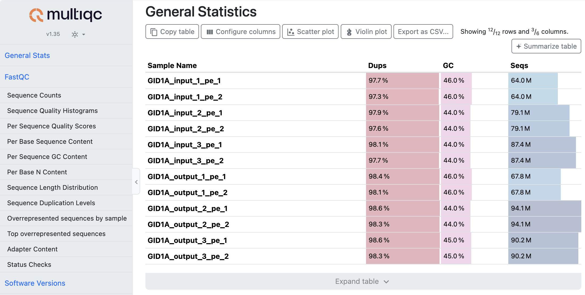
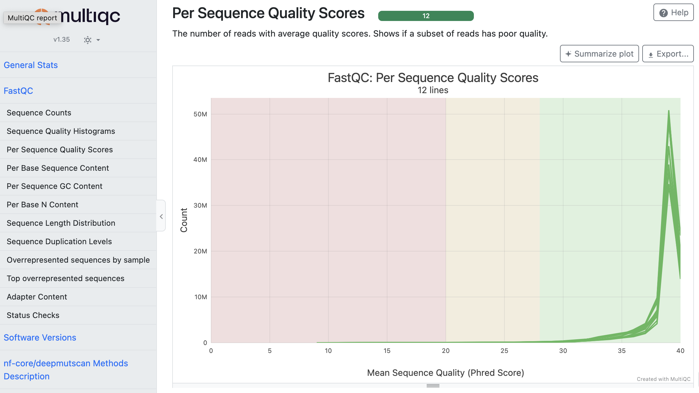
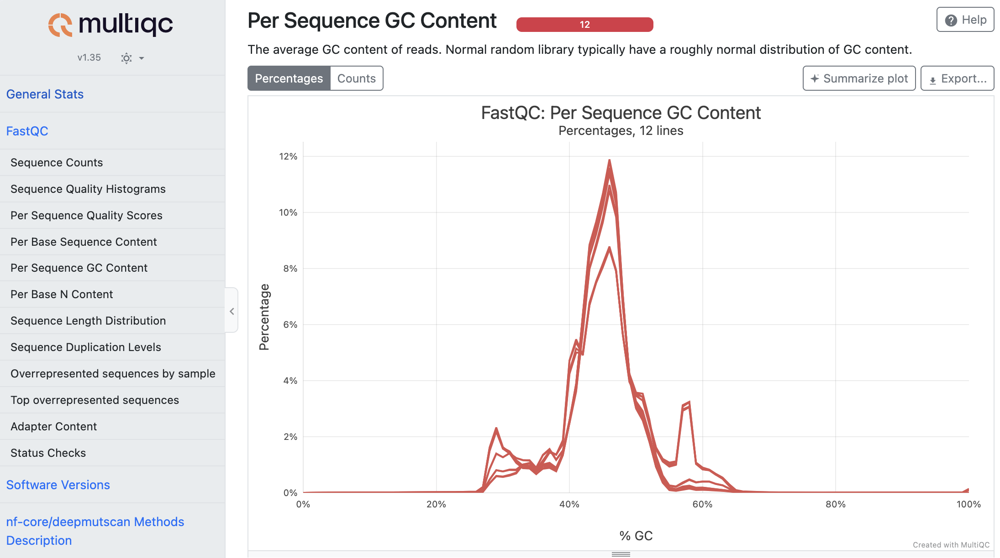

### Intermediate files

<details markdown="1">
<summary>Output files</summary>

- `intermediate_files/`
  - `aa_seq.txt`: wildtype amino acid sequence translated from `--reading_frame`.
  - `possible_mutations.csv`: all programmed codon variants per position, as defined by `--mutagenesis_type`; used for library filtering and visualisation.
  - `bwa/`: BWA index of the reference FASTA.
  - `bam_files/bwa/mem/<sample>.bam`: raw read alignments.
  - `bam_files/filtered/<sample>_filtered.bam`: alignments after removal of unmapped, secondary, low mapping-quality (MAPQ < 30) and indel-containing reads.
  - `bam_files/premerged/<sample>_merged.bam`: alignments of merged read pairs (consensus reads), used for variant counting.
  - `bam_files/sorted/<sample>.sorted.bam` and `.bai`: coordinate-sorted and indexed merged alignments.
  - `variant_counts/<sample>/<library>.variant_counts.tsv`: raw variant count table with one row per observed combination of nucleotide changes, its count, coverage and codon / amino acid annotation.
  - `variant_counts/<sample>/variant_counts_columns.tsv`: description of every column of the variant count table.
  - `processed_variant_counts/<sample>/`:
    - `annotated_variantCounts.csv`: variant counts annotated with codon and amino acid changes and counts per coverage.
    - `variantCounts_filtered_by_library.csv`: single-codon variants that match the programmed library.
    - `library_completed_variantCounts.csv`: all programmed variants, including unobserved ones (with a near-zero placeholder count), used for the count distribution plots.
    - `variantCounts_for_heatmaps.csv`: counts and counts per coverage aggregated per position and amino acid, used for the count heatmaps.

</details>

These files document every step from raw reads to variant frequencies.

### Error correction

<details markdown="1">
<summary>Output files</summary>

- `intermediate_files/processed_variant_counts/<sample>/` (unless `--error_correction none`)
  - `variantCounts_filtered_by_library_error_corrected.csv`, `library_completed_variantCounts_error_corrected.csv`, `variantCounts_for_heatmaps_error_corrected.csv`: corrected versions of the tables above. The corrected counts are used by all downstream steps; in `variantCounts_filtered_by_library_error_corrected.csv`, the original counts are kept in the `counts_raw` and `counts_per_cov_raw` columns.
  - `seq_error_rate.csv` (`--error_correction false_doubles` only): estimated sequencing error rate for every possible single-nucleotide substitution along the reference.
- `library_QC/`
  - `error_correction_report.html`: interactive report of the correction across all libraries of the run.

</details>

The error-correction report shows the single-nucleotide substitution error correlation across samples, raw versus corrected counts, the distribution of per-variant correction magnitudes, positional error bias along the ORF and a searchable per-variant table. Libraries can be selected and deselected in the report, for example to compare input and output libraries.

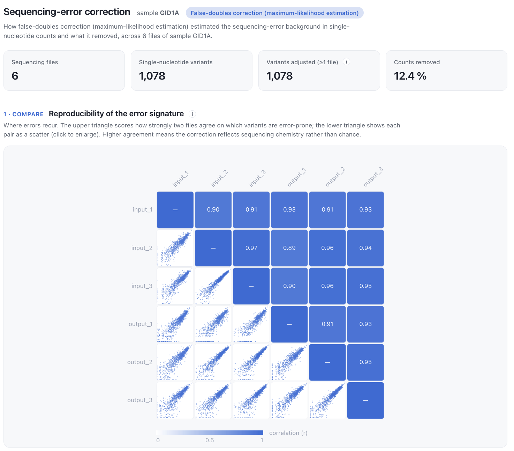
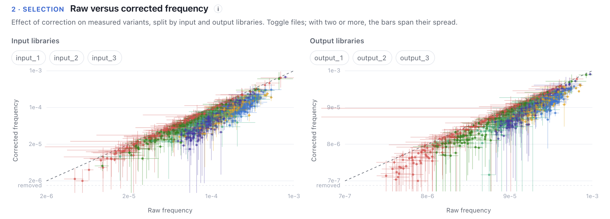
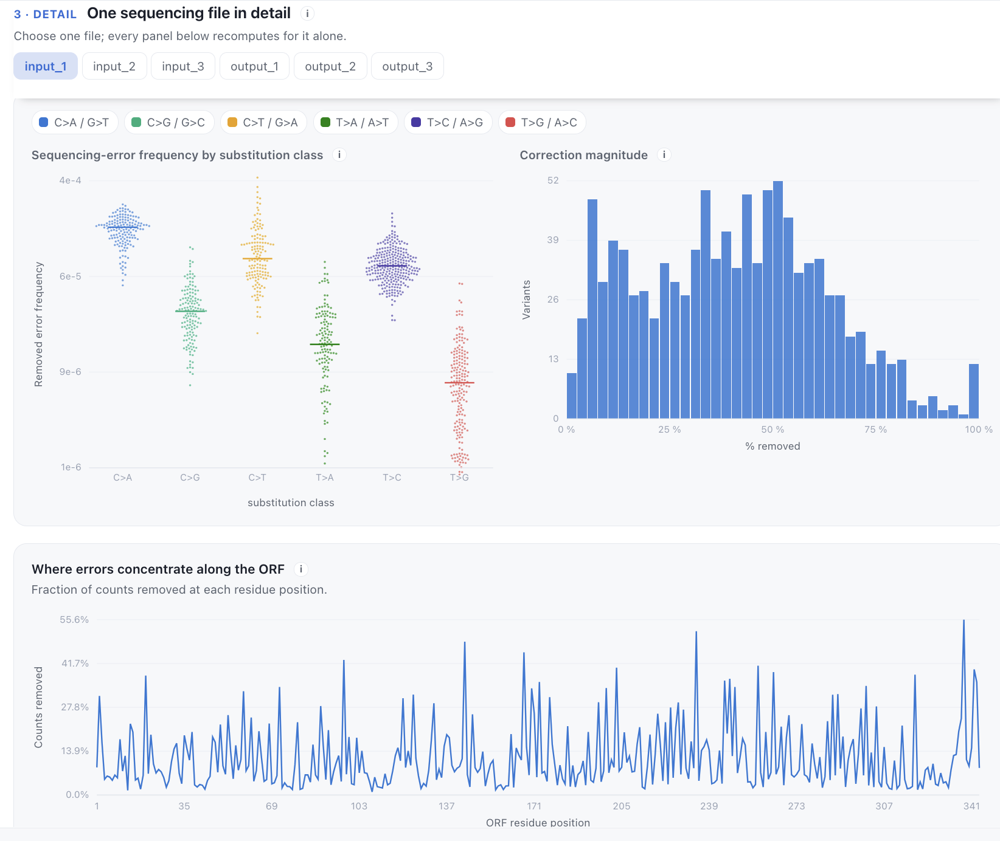

### Library QC

<details markdown="1">
<summary>Output files</summary>

- `library_QC/<library>/`
  - `counts_heatmap.pdf`: variant counts per position (x-axis) and mutant amino acid (y-axis).
  - `counts_per_cov_heatmap.pdf`: as above, but as counts per sequencing coverage.
  - `logdiff_plot.pdf`: sorted, log-scale distribution of counts per coverage of all programmed variants, with the log10 ratio of their 90th and 10th percentiles.
  - `logdiff_varying_bases.pdf`: as above, stratified by the number of changed nucleotides per codon.
  - `rolling_coverage.pdf`: sliding-window sequencing coverage along the ORF, with the coverage required to observe every amino acid variant `--aimed_cov` times.
  - `rolling_counts.pdf`: sliding-window variant counts along the ORF, stratified by the number of changed nucleotides per codon.
  - `rolling_counts_per_cov.pdf`: as above, but as counts per coverage.
  - `SeqDepth.pdf` and `seqdepth_curve.csv` (with `--run_seqdepth`, default): sequencing-depth rarefaction curve, i.e. the expected fraction of programmed variants that remain detected when the library is subsampled to lower sequencing depths.

</details>

These plots help to judge the success of the mutagenesis (are all positions and amino acids represented?), the evenness of the fragmentation and sequencing coverage along the ORF, and whether a library was sequenced deeply enough.

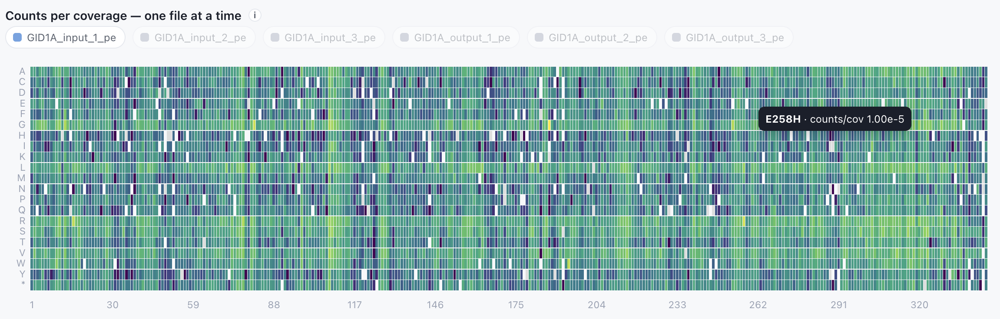


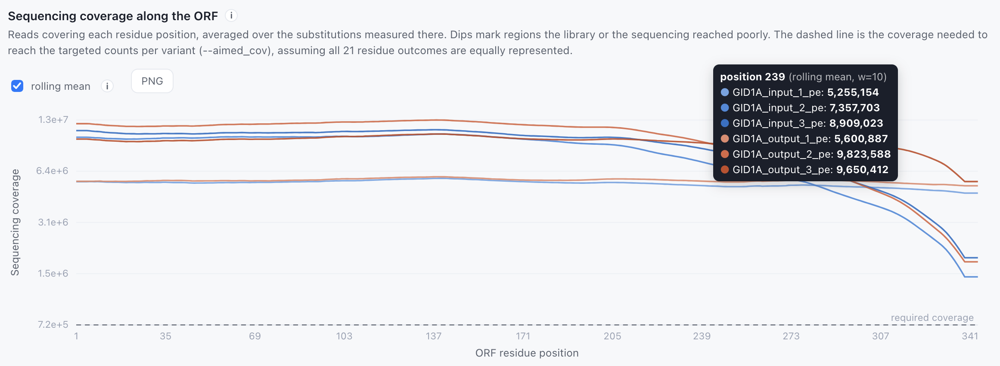
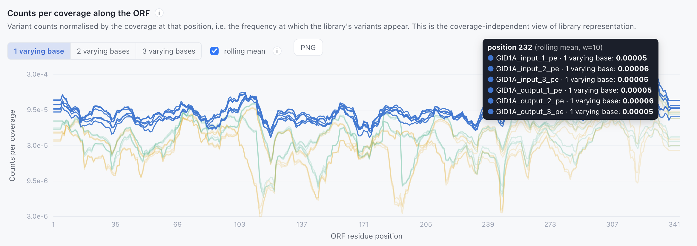
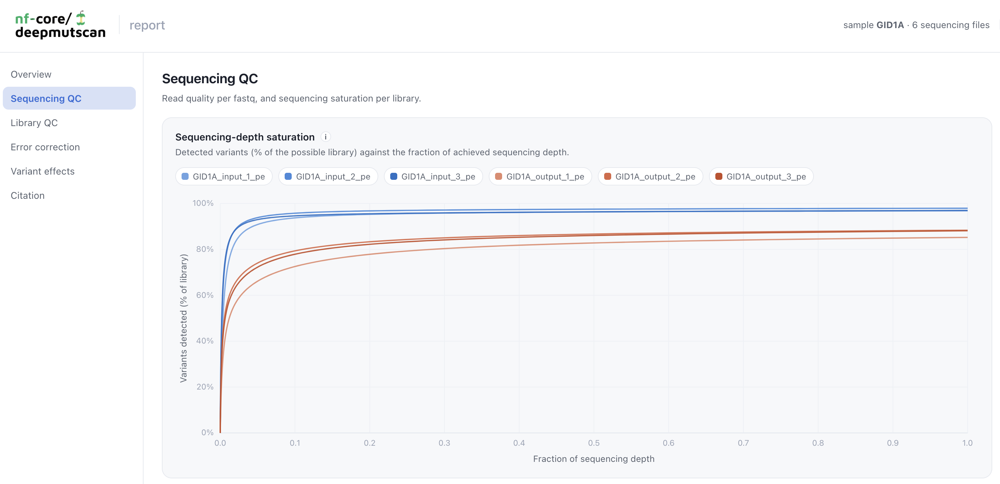

### Fitness

<details markdown="1">
<summary>Output files</summary>

- `fitness/`
  - `counts_merged.tsv`: merged variant counts of all `input` and `output` libraries of a sample.
  - `experimentalDesign.tsv`: experimental design derived from the original samplesheet (DiMSum input format).
  - `synonymous_wt.txt`: nucleotide sequence of the synonymous variant used as wildtype proxy.
  - `default_results/`
    - `fitness_estimation.tsv`: per-variant counts, raw and rescaled fitness per replicate, and mean fitness and standard deviation across replicates.
    - `fitness_estimation_count_correlation.pdf`: pairwise variant count correlations between all libraries.
    - `fitness_estimation_fitness_correlation.pdf`: pairwise fitness correlations between replicates.
    - `fitness_heatmap.pdf`: mean fitness per position (x-axis) and mutant amino acid (y-axis).
  - `DiMSum_results/`
    - `single_rep_counts/<library>_fitness_input.tsv`: per-library count tables in DiMSum input format. These are written for every run, also without `--fitness`.
    - `dimsum_results/` (with `--dimsum`): the complete [DiMSum](https://github.com/lehner-lab/DiMSum) default output, including its HTML `report.html`, fitness tables (`fitness_singles.txt`, `fitness_doubles.txt`, `fitness_synonymous.txt`, `fitness_wildtype.txt`, `fitness_singles_MaveDB.csv`) and `.RData` objects.
  - `mutscan_results/` (with `--mutscan`)
    - `fitness_estimation_mutscan_edgeR.tsv`, `fitness_estimation_mutscan_limma.tsv`: [mutscan](https://github.com/fmicompbio/mutscan) default variant enrichment estimates with edgeR and limma.
    - `mutscan_counts_corr.pdf`, `mutscan_edgeR_volcano.pdf`, `mutscan_limma_volcano.pdf`: count correlation and volcano plots.

</details>

Fitness is only estimated with `--fitness` and requires at least one `input` and one `output` library per sample. See the [usage documentation](usage.md#8-fitness-estimation-optional) for how fitness is calculated. Fitness values are scaled so that wild-type synonymous variants centre on 0 and stop codon (nonsense) variants on -1.


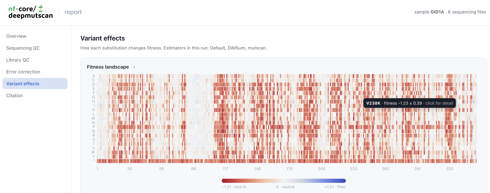

### Variant effect inspection tool

<details markdown="1">
<summary>Output files</summary>

- `variant_effect_inspection_tool/` (with `--fitness` and `--pdb`)
  - `variant_effect_inspection_tool.html`: self-contained, interactive 3D structure viewer.
  - `structure_data.json`: the per-residue and per-variant data shown in the viewer.

</details>

This tool projects the mean per-residue fitness, coverage, counts, counts per coverage and – when error correction is on – the positional error bias onto the supplied wildtype 3D structure. Selecting a residue shows the effect of each substitution. The file works offline and can be shared as a single file.

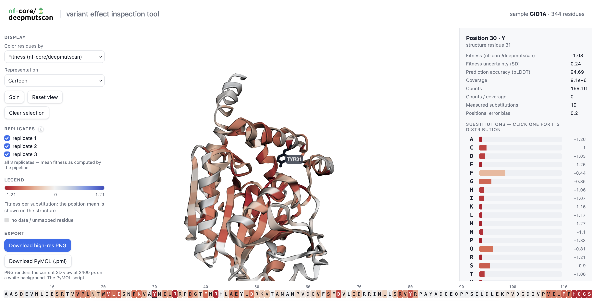

### All-in-one report

<details markdown="1">
<summary>Output files</summary>

- `deepmutscan_report.html`: a single, self-contained HTML report of the run.

</details>

The report brings all the important metrics and visual results of a run together in one file; it can be opened in any browser and shared without any accompanying files. Features are a complete `nf-core` run overview with parameters and execution statistics, interactive sequencing and library QC plots per library, the error-correction report, the fitness results and heatmap (with `--fitness`), the DiMSum and mutscan results (if run), a 3D structure view (with `--pdb`), the MultiQC report, and the citations of all the tools and major dependencies that were used in the run.

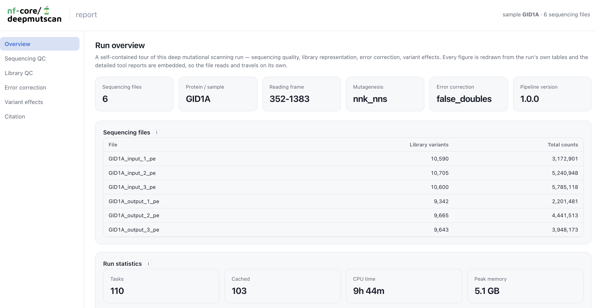

### Pipeline information

<details markdown="1">
<summary>Output files</summary>

- `pipeline_info/`
  - Reports generated by Nextflow: `execution_report_<timestamp>.html`, `execution_timeline_<timestamp>.html`, `execution_trace_<timestamp>.txt` and `pipeline_dag_<timestamp>.html`.
  - Reports generated by the pipeline: `pipeline_report.html`, `pipeline_report.txt` and `nf_core_deepmutscan_software_mqc_versions.yml`. The `pipeline_report*` files will only be present if the `--email` / `--email_on_fail` parameters are used when running the pipeline.
  - Parameters used by the pipeline run: `params_<timestamp>.json`.

</details>

[Nextflow](https://www.nextflow.io/docs/latest/tracing.html) provides excellent functionality for generating various reports relevant to the running and execution of the pipeline. This will allow you to troubleshoot errors with the running of the pipeline, and also provide you with other information such as launch commands, run times and resource usage.
